# Exercise 2: Analyze Copilot Adoption & User Engagement

### Estimated Duration: 15 Minutes

## Overview

In this exercise, you will load the Copilot organization usage data into Power BI and create essential measures to understand adoption patterns, user engagement levels, and team performance. You'll build visualizations that help managers identify top performers, engagement gaps, and areas for improvement across different teams and technologies.

## Objectives

You will be able to complete the following tasks:

- Task 1: Import Copilot usage data and understand the data structure
- Task 2: Create adoption and engagement measures for management insights
- Task 3: Build visualizations to identify usage patterns and team performance

## Prerequisites

- Successful completion of Exercise 1 with `copilot_org.csv` downloaded
- Power BI Desktop installed and signed in
- Basic familiarity with Power BI interface

## Task 1: Import and Configure Copilot Usage Data

In this task, you will load the GitHub Copilot organization usage data into Power BI Desktop to begin your analysis journey. This foundational step establishes the data connection that will power all your management insights, allowing you to understand adoption patterns, user engagement levels, and technology preferences across your development teams.

1. Launch **Power BI Desktop** from the desktop shortcut in your lab environment.

   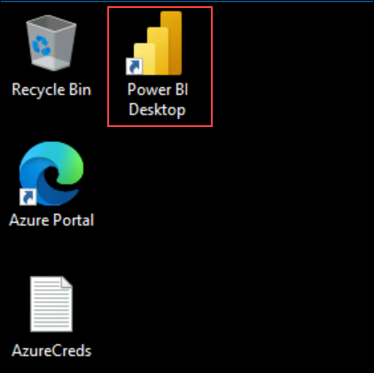

   >**Getting Started:** Power BI Desktop allows you to connect to, transform, and visualize your data. It's the primary tool for creating interactive reports and dashboards.

1. Verify that you are signed in successfully your username will appear in the top-right corner.

   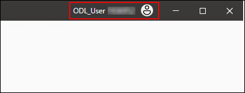

1. On the **Home** screen, select **Blank report**.

   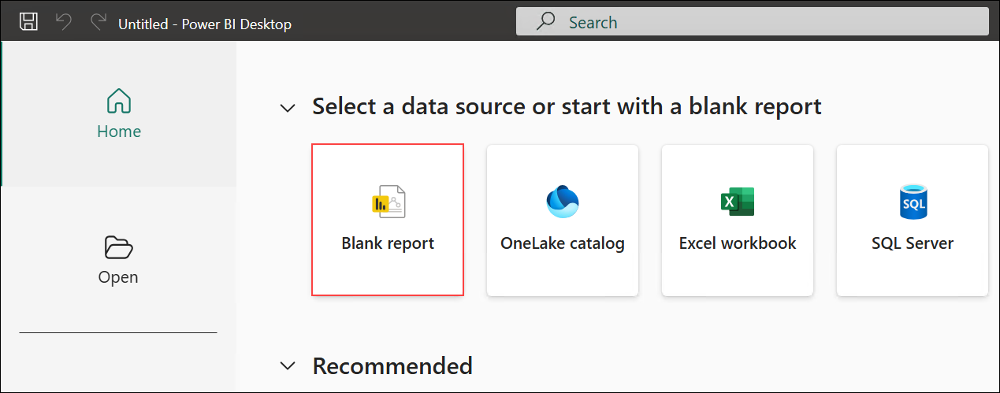

1. Go to the **Home (1)** tab and click **Get data (2)**.

   

1. In **Get Data**, choose **Text/CSV (1)** and select **Connect (2)**.

   

1. In the file picker, browse to **C:\Copilot_Datasets (1)**, select **copilot_org (2)**, and click **Open (3)**.

   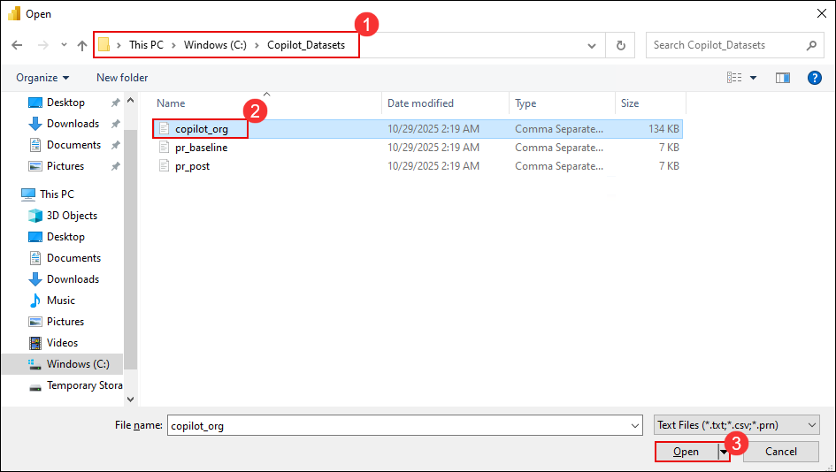

1. In the preview dialog, confirm the delimiter is **Comma (1)** and click **Load (2)**.

   

1. To publish the agent, click **Publish** in the dialog.

   

1. Once published, you can see your **Safe Travels Agent (2)** listed in the Agents page. Click on **New agent (1)** to create additional agents if needed.

   

1. Click on the **+5 (1)** menu to access additional options. Select **Agents (2)** to manage your agents or access other features like Topics, Activity, Analytics, and Channels.

   

1. On the "Add an agent" page, you can add additional agents to work together in your workflow. Click **Add** to create a new agent that will collaborate with your existing Safe Travels Agent.

   

1. Choose how you want to extend your agent from the available options. You can either create a new agent or connect an existing agent from **Copilot Studio** or **Microsoft Fabric**. Select your preferred option to proceed.

   

1. Select the **Leave Manager Agent** from the available agents to connect.

   

1. Review the agent configuration and click **Add agent** to complete the connection.

   

1. Verify that the **Leave Manager Agent** is now connected and enabled in the Agents tab.

   

1. Navigate to **Generative AI (1)** settings, ensure **Yes (2)** is selected for orchestration, and click **Save (3)**.

   

1. Click on **New agent (1)** to create additional agents, then select the **Leave Manager Agent (2)**.

   

1. Click **Publish** to publish the Leave Manager Agent.

   

1. In the publish dialog, click **Publish** to confirm.

   

1. Navigate back to the **Safe Travels Agent (2)** from the agents list.

   

1. Click **Publish** to publish the Safe Travels Agent with the connected Leave Manager Agent.

   

1. In the publish dialog, click **Publish** to confirm.

   

1. Click **Test** to test the agent functionality.

   

1. Type **Check Leave balance (1)** and click the **send button (2)** to test the Leave Manager Agent integration.

   

1. Enter **1234 (1)** as the Employee ID and click **send (2)**.

   

1. Type **1234 is my Employee ID can you check my Leave balance (1)** and click **send (2)**.

   

   >**Understanding Your Data**: The copilot_org dataset contains comprehensive daily usage metrics per user that provide crucial insights for management decision-making:
> - **Suggestions & Acceptances**: Measures both the volume of AI assistance offered and the quality/relevance as indicated by developer acceptance rates
> - **Teams & Roles**: Organizational context that allows you to compare adoption across different groups and experience levels
> - **Technology Preferences**: Editor (VS Code, JetBrains) and programming language data that helps identify which technology stacks benefit most from Copilot
> - **Chat Usage**: Both IDE-integrated and web-based AI chat interactions that indicate advanced feature adoption
> - **Activity Patterns**: Last activity dates and PR summary usage that help identify engagement trends and feature utilization

## Task 2: Create Strategic Management Measures

In this task, you'll create essential calculated measures that transform raw usage data into meaningful management insights. These measures will help you understand user engagement levels, team performance comparisons, and identify successful adoption patterns that can be replicated across your organization.

> **Manager's Perspective:** As a manager, you need metrics that answer critical questions: Who's actively using Copilot? How effectively are they using it? Which teams are seeing the best results? These measures provide those answers in quantifiable terms.

1. In the **Data (1)** pane on the right side of Power BI Desktop, right-click your **copilot_org (2)** table and choose **New measure (3)** from the context menu.

   

   >**Understanding Measures:** Measures are calculations that Power BI performs on your data in real-time. Unlike columns which store data, measures calculate values dynamically based on your current filters and selections.

1. Create a new measure named **Active Users (1)**: in the formula bar **(1)** paste the DAX below, then select **✔ (2)** to confirm

   ```
   Active Users = DISTINCTCOUNT('copilot_org'[user_login])
   ```

   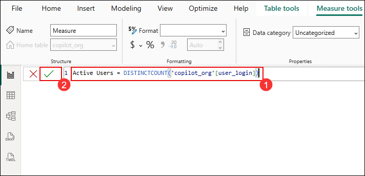

1. Add another measure: right-click your **copilot_org (2)** table and choose **New measure (3)** from the context menu.

   

1. Create **Total Suggestions** : in the formula bar **(1)** paste the DAX below, then select **✔ (2)** to confirm

   ```
   Total Suggestions = SUM('copilot_org'[suggestions])
   ```

   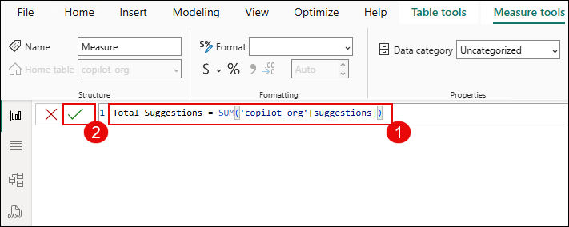

1. Add another measure: right-click your **copilot_org (2)** table and choose **New measure (3)** from the context menu.

   

1. Create **Total Acceptances**: in the formula bar **(1)** paste the DAX below, then select **✔ (2)** to confirm

   ```
   Total Acceptances = SUM('copilot_org'[acceptances])
   ```

   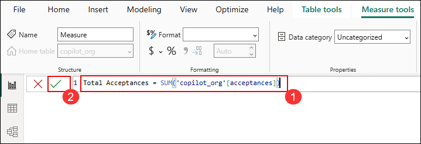

1. Add another measure: right-click your **copilot_org (2)** table and choose **New measure (3)** from the context menu.

   

1. Create **Acceptance Rate %** to measure code suggestion quality:

   ```
   Acceptance Rate % = DIVIDE([Total Acceptances], [Total Suggestions], 0)
   ```

   

   > **Manager Insight**: Acceptance rate indicates how relevant Copilot suggestions are. Higher rates (>50%) typically indicate better user adoption and tool effectiveness.

1. Add measure: right-click your **copilot_org (2)** table and choose **New measure (3)** from the context menu.

   

1. Create **Chat Users** to identify users leveraging AI chat:

   ```
   Chat Users = CALCULATE(
       DISTINCTCOUNT('copilot_org'[user_login]),
       'copilot_org'[ide_chat_interactions] > 0 || 'copilot_org'[dotcom_chat_interactions] > 0
   )
   ```

   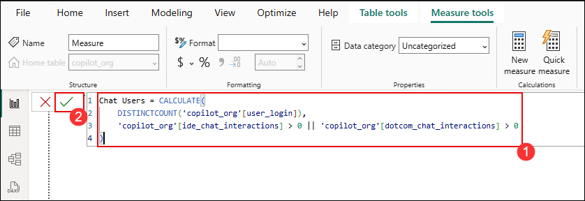

1. Add measure: right-click your **copilot_org (2)** table and choose **New measure (3)** from the context menu.

   

1. Create **Total Chat Interactions**:

   ```
   Total Chat Interactions = 
   SUM('copilot_org'[ide_chat_interactions]) + 
   SUM('copilot_org'[dotcom_chat_interactions])
   ```

   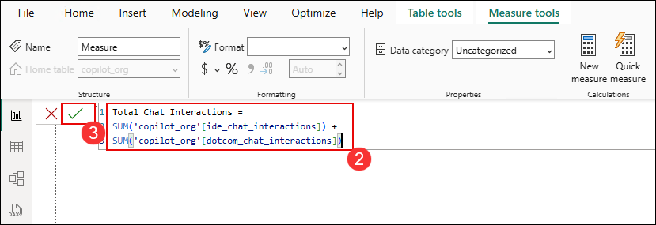

1. Add measure: right-click your **copilot_org (2)** table and choose **New measure (3)** from the context menu.

   

1. Create **Highly Engaged Users** (users with significant activity):

   ```
   Highly Engaged Users = CALCULATE(
       DISTINCTCOUNT('copilot_org'[user_login]),
       'copilot_org'[acceptances] >= 10
   )
   ```

   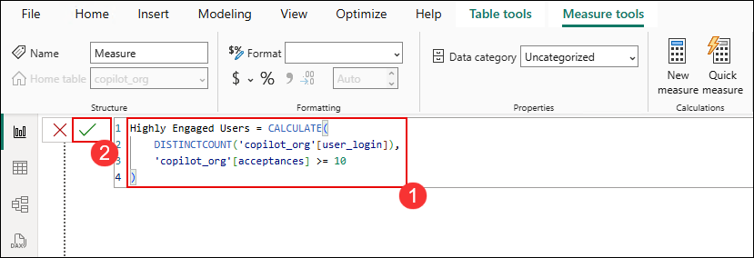

   > **Manager Insight**: Highly engaged users are those accepting 10+ suggestions, indicating they're getting substantial value from Copilot.

1. Add measure: right-click your **copilot_org (2)** table and choose **New measure (3)** from the context menu.

   

1. Create **Team Adoption Rate**:

   ```
   Team Adoption Rate = DIVIDE([Highly Engaged Users], [Active Users], 0)
   ```

   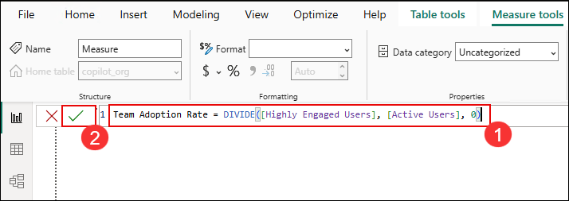

## Task 3: Build Interactive Management Dashboards

In this task, you will create comprehensive visualizations that transform your data into actionable management insights. These dashboards will help you identify adoption patterns, recognize top-performing teams, and spot areas that may need additional support or training interventions.

### A. Create Team Performance Overview Dashboard

1. Rename your report page for better organization. Right-click on the page tab at the bottom and select **Rename**. Change it to **Copilot Adoption**.

   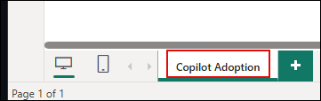

   >**Dashboard Organization:** Clear page names help stakeholders navigate your reports easily and understand the focus of each analysis section.

1. Insert a **Table** visual from the Visualizations pane.

   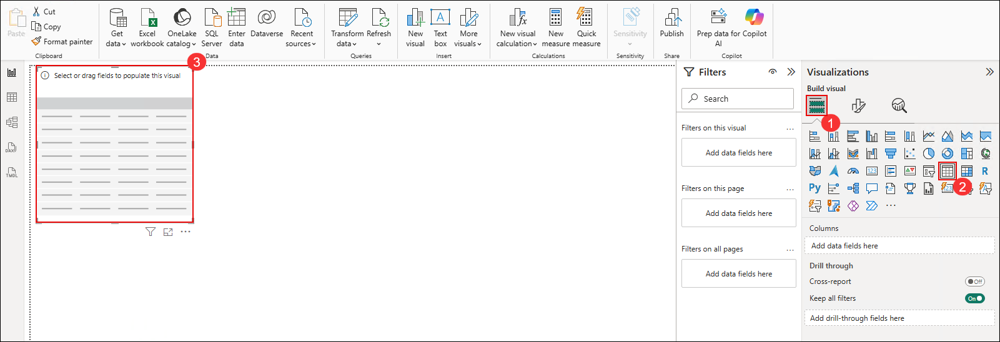

1. Add these fields to the table under the **Columns**.

   - **team (1)**
   - **Active Users (2)**
   - **Highly Engaged Users (3)**
   - **Team Adoption Rate (4)**
   - **Total Acceptances (5)**

      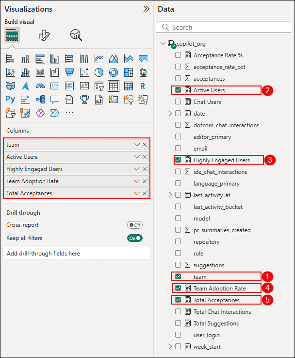

1. Once all columns are added, the table will display the metrics for each team. Review the created table — it should look like the example below.  

   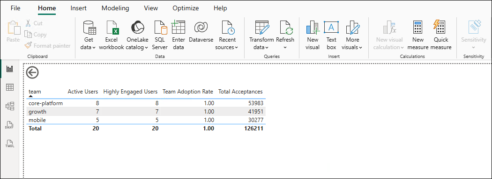

   > **Manager Value**: This table shows which teams are adopting Copilot most effectively and where you might need additional training or support.

1. Format the **Table** visual for better presentation:

   - Select the **Table** visual **(1)**.
   - Open the **Visualizations** pane **(2)**.
   - Under the **Format visual** section, select **General (3)**.
   - In the **Effects** area, turn **On** the **Background**, **Visual border**, and **Shadow** options **(4)**.   

      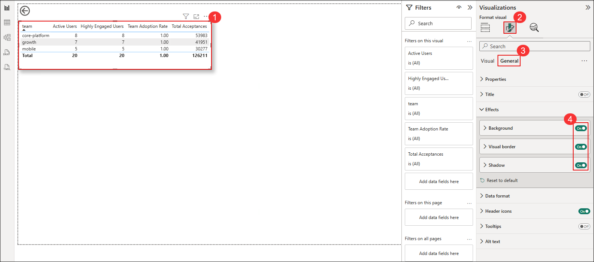

### B. Create User Engagement Analysis

1. Insert a **Clustered bar chart**: in the **Visualizations** pane, select the **Bar chart** icon (1), then click **Clustered bar chart** (2). A blank visual will appear on the canvas (3). 

   

1. Configure the chart:
   - **Y-axis**: user_login
   - **X-axis**: Total Acceptances
   - **Legend**: team

      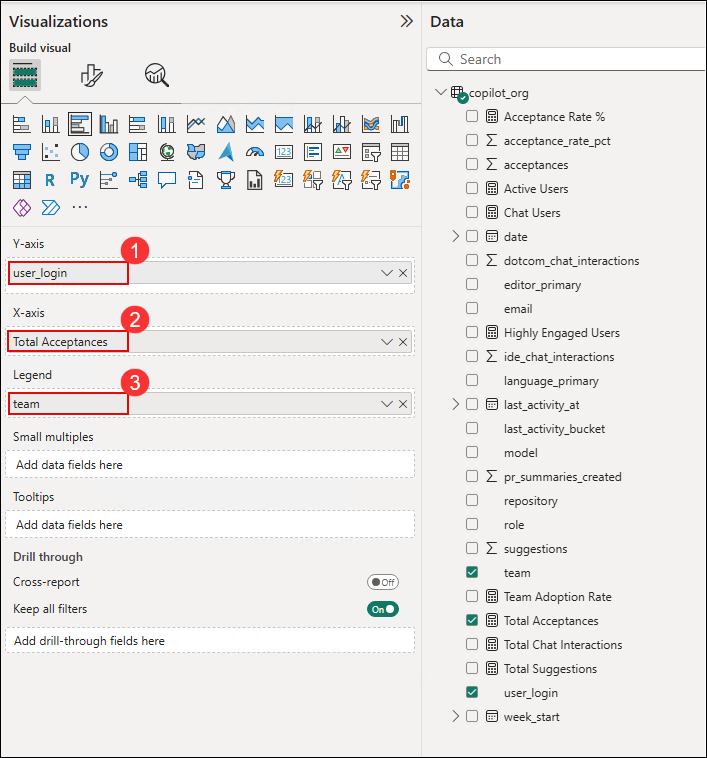

1. Review the chart — it should resemble the example below.

   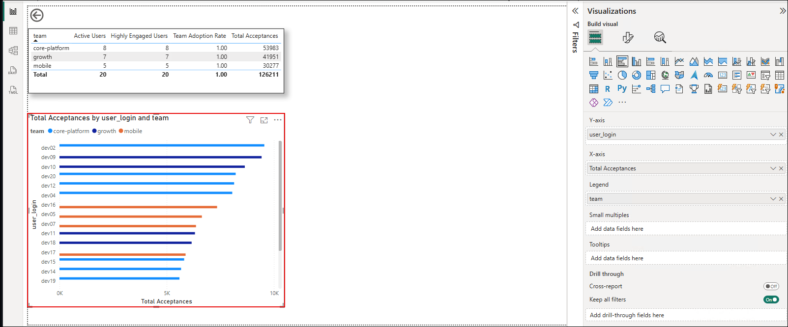

1. Notice that when you click a **team** in the bar chart (1), the corresponding data in the **table visual** (2) automatically updates — showing interactive filtering between visuals.

   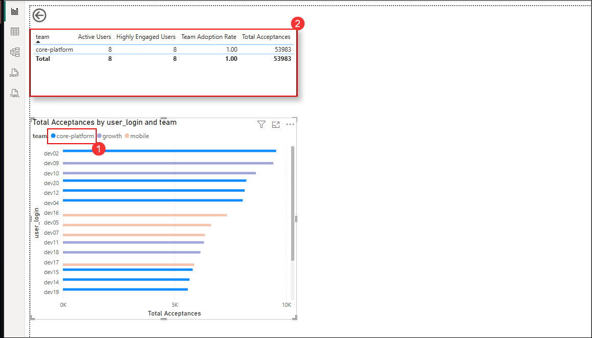

   > **Manager Insight**: This identifies your top Copilot users and shows team distribution, helping you identify champions for peer training.

### C. Create Technology Adoption Matrix

1. Insert a **Matrix** visual: in the **Visualizations (1)** pane, select the **Matrix (2)** icon; a **blank matrix visual (3)** will appear on the canvas.

   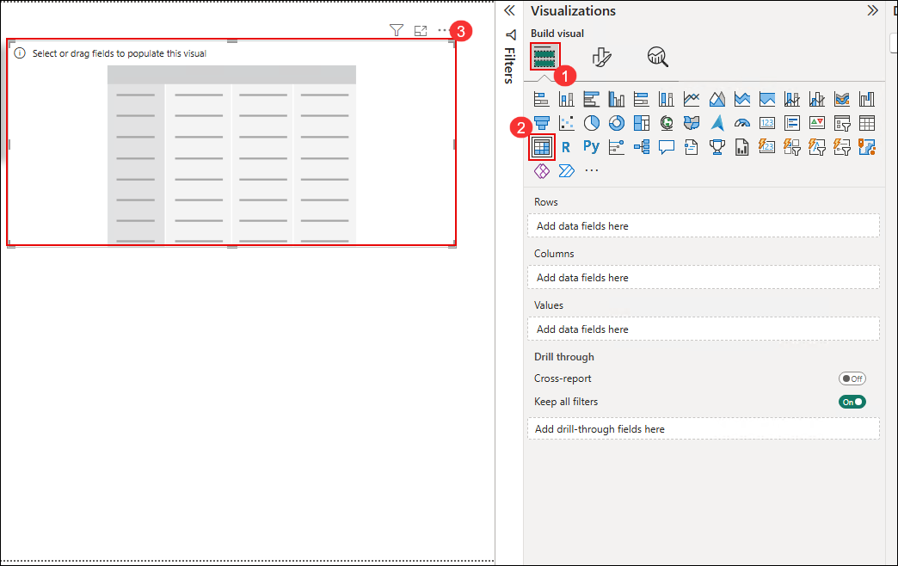

1. Configure the **Matrix** visual as shown below:  
   - **Rows (1):** editor_primary  
   - **Columns (2):** language_primary  
   - **Values (3):** Active Users, Acceptance Rate %  

      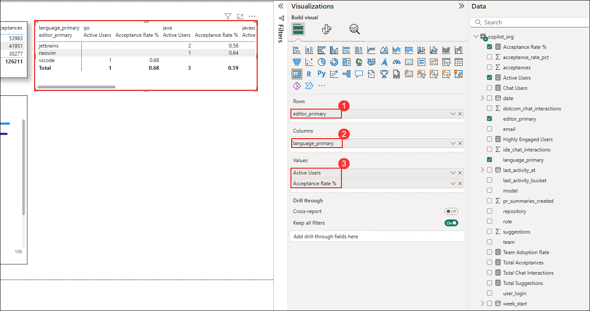

      > **Manager Value**: This shows which technology combinations are most successful with Copilot, informing training and tooling decisions.

### D. Add Interactive Filters

1. Insert a **Slicer** for **team**: in the **Visualizations (1)** pane, select the **Slicer (2)** icon; a **blank slicer visual (3)** will appear on the canvas.

   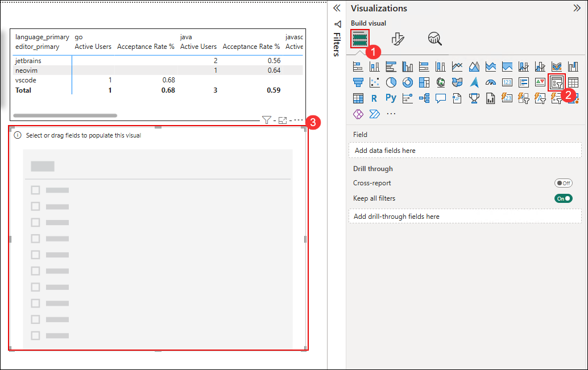

1. Configure the **Slicer** visual: add **team (1)** and **role (2)** fields under **Field** to enable filtering by both attributes.

   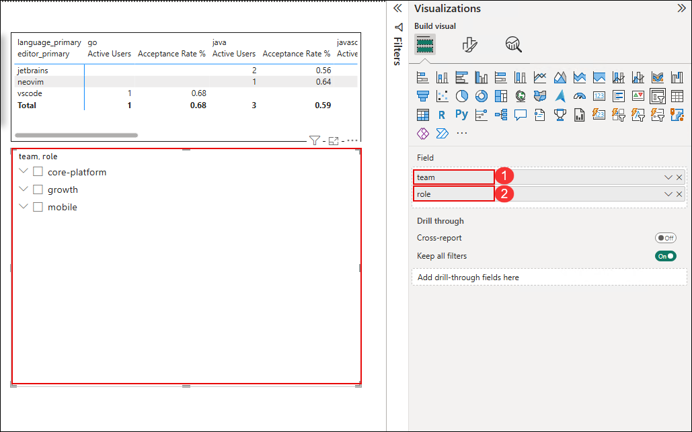

1. Test the **Slicer** interactivity: select a **team (1)** and a specific **role (2)** — observe that all visuals dynamically update to reflect the selected filters.  

   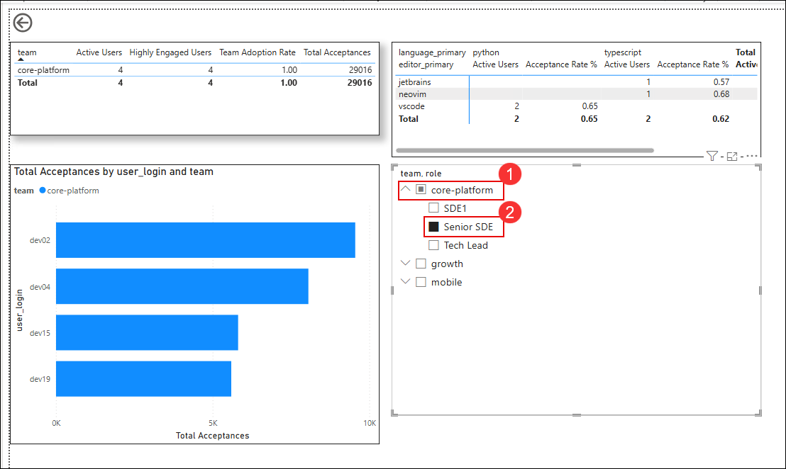

1. Select another **team (growth)** from the **Slicer** to verify that all visuals update dynamically based on the selected filter. 

   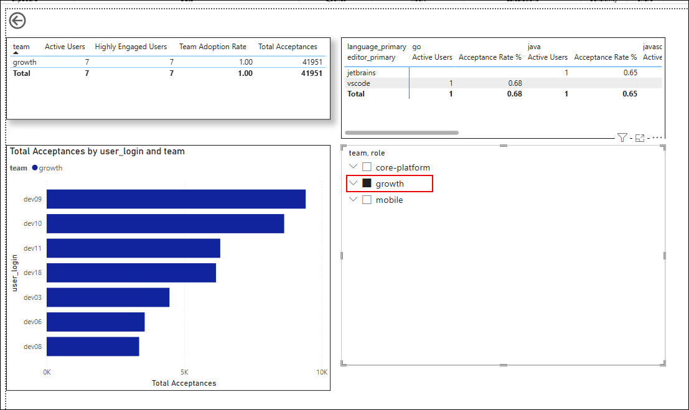

   > **Manager Benefit**: These slicers allow you to drill down into specific teams or roles to understand adoption patterns and identify coaching opportunities.

## Notes

- Focus on trends rather than absolute numbers - adoption patterns are more important than raw usage counts
- Pay attention to acceptance rates by team/technology to identify where Copilot is working best
- Use this data to identify Copilot champions who can help train others
- Consider the experience level (role) when analyzing adoption - senior developers might use chat more while junior developers might rely more on code suggestions

## Summary

In this exercise, you successfully transformed raw Copilot usage data into meaningful management insights through comprehensive adoption and engagement analysis. You created strategic measures that help managers identify high-performing teams, understand technology preferences, and spot areas where additional support or training may be needed. The interactive dashboards you built provide the foundation for data-driven decisions about Copilot program optimization. These adoption metrics will now serve as the baseline for measuring productivity improvements in the next exercise, creating a complete picture of Copilot's organizational impact.

### You have successfully completed this exercise, please continue to next one >>
