# Exercise 3: Measure Productivity Impact with PR Analysis

### Estimated Duration: 15 Minutes

## Overview

In this exercise, you will import and analyze pull request (PR) metrics from before and after Copilot adoption to measure concrete productivity improvements. You'll compare baseline metrics with post-adoption metrics to quantify the business impact of GitHub Copilot across development teams.

## Objectives

You will be able to complete the following tasks:

- Task 1: Import PR baseline and post-adoption data
- Task 2: Create productivity comparison measures
- Task 3: Build executive-ready productivity impact visualizations

## Prerequisites

- Completion of Exercise 2 with Copilot adoption analysis
- PR baseline and post-adoption CSV files available
- Understanding of software development metrics (lead time, cycle time, PR throughput)

## Task 1: Import and Configure PR Performance Data

In this task, you will load both baseline (pre-Copilot) and post-adoption pull request metrics to establish a comprehensive foundation for measuring concrete productivity improvements. This comparative analysis will provide the quantitative evidence needed to demonstrate Copilot's business impact to stakeholders and executives.

1. Create a new analysis page by clicking the **+ (plus)** icon next to your existing page tab to add a new sheet.

   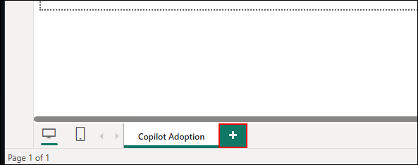

   >**Organizing Analysis:** Separating adoption metrics from productivity impact analysis helps stakeholders focus on specific aspects of Copilot's value proposition without overwhelming them with too much information at once.

1. Rename it to **PR Impact**.

   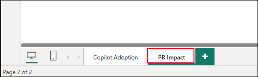

1. On the **Home** tab (1), click **Get data** (2) to start importing your dataset into Power BI Desktop.

   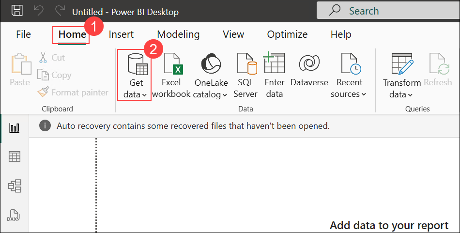

1. In **Get Data**, choose **Text/CSV (1)** and select **Connect (2)**.

   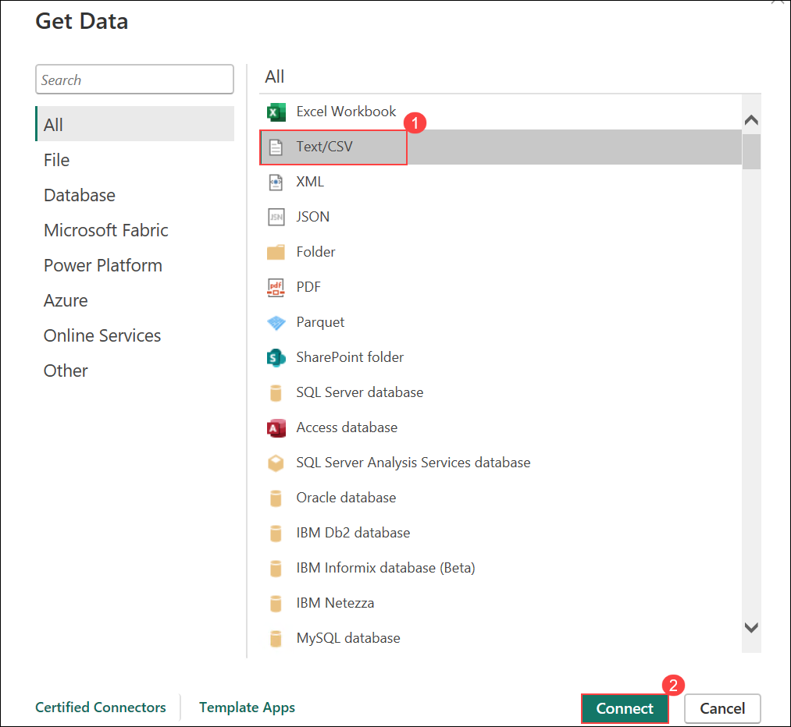

1. Navigate to **C:\\Copilot_Datasets** (1), select the file **pr_baseline.csv** (2), and click **Open** (3) to import it into Power BI.

   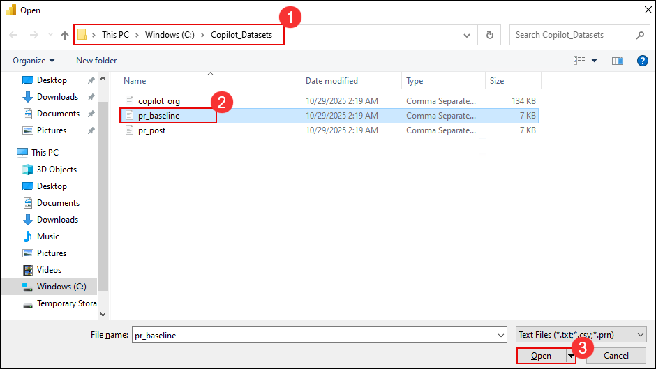

1. In the preview dialog, verify the data looks correct and click **Load**.

   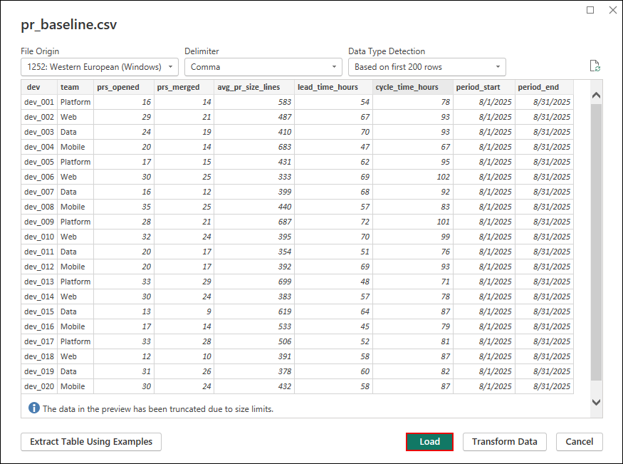

1. Again on the **Home** tab (1), click **Get data** (2) to start importing your dataset into Power BI Desktop.

   

1. In **Get Data**, choose **Text/CSV (1)** and select **Connect (2)**.

   

1. Navigate to **C:\\Copilot_Datasets** (1), select the file **pr_post.csv** (2), and click **Open** (3) to import the post-adoption dataset.

   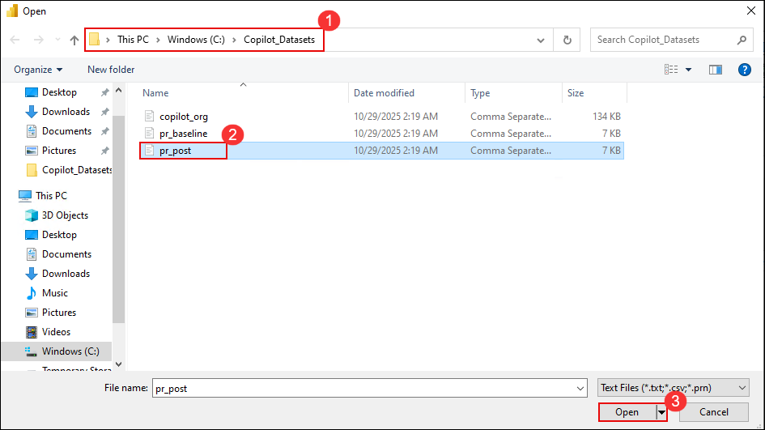

1. In the preview dialog, verify the data looks correct and click **Load**.

   

   > **Understanding Development Productivity Metrics**: 
> - **Lead Time**: Total time from PR creation to merge, including development work, code reviews, and approval processes - a key indicator of delivery velocity
> - **Cycle Time**: Active development time spent working on code changes, reflecting developer efficiency and focus
> - **PR Size**: Lines of code changed per pull request, indicating complexity and scope of individual contributions
> - **Throughput**: Number of pull requests successfully opened and merged per time period, measuring team delivery capacity
> 
> **Manager Value**: These metrics provide objective measures of development team performance that can be tracked over time to demonstrate the concrete business impact of Copilot adoption.## Task 2: Create Comprehensive Productivity Impact Measures

In this task, you'll create sophisticated measures that quantify the concrete productivity improvements achieved through Copilot adoption. These measures will translate development efficiency gains into quantifiable metrics that demonstrate clear business value and ROI to executive stakeholders.

1. In the **Data** pane, right-click the **pr_baseline** table (1) and select **New measure** (2) to create a new DAX measure.

   

1. In the formula bar, enter the DAX expression for the measure (1) and click **✔** (2) to confirm.

   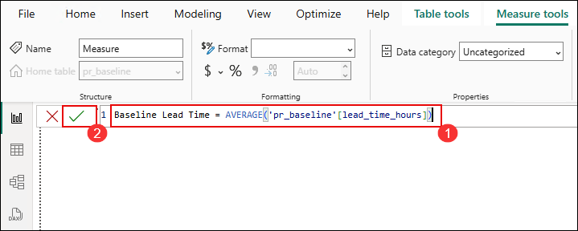

   ```
   Baseline Lead Time = AVERAGE('pr_baseline'[lead_time_hours])
   ```

   >**Understanding Lead Time:** Lead Time measures the total duration from when a pull request is created until it's merged into the main branch. This includes development time, review cycles, and approval processes - a key indicator of delivery velocity.

1. In the **Data** pane, right-click the **pr_post** table (1) and choose **New measure** (2) to create a post-adoption measure.

   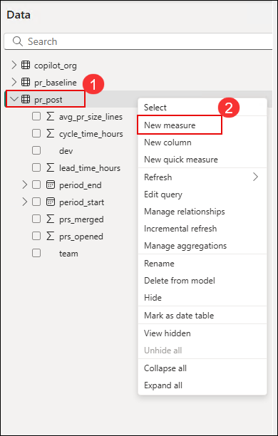

1. In the formula bar, enter the DAX expression for the post-adoption measure (1) and click **✔** (2) to confirm.

   ```
   Post-Copilot Lead Time = AVERAGE('pr_post'[lead_time_hours])
   ```

   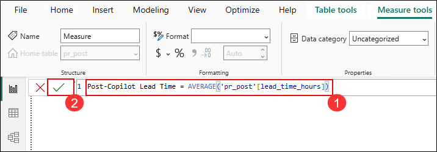

1. In the **Data** pane, right-click the **pr_baseline** table (1) and select **New measure** (2) to create a new DAX measure.

   

1. Paste the DAX for **Lead Time Improvement** in the formula bar (1), then click **✔** (2) to create the measure.

   ```
   Lead Time Improvement = [Baseline Lead Time] - [Post-Copilot Lead Time]
   ```

   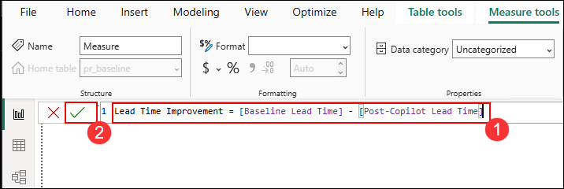

1. In the **Data** pane, right-click the **pr_baseline** table (1) and select **New measure** (2) to create a new DAX measure.

   

1. In the formula bar, paste the DAX for **Lead Time Improvement %** (1) given below and click **✔** (2) to save and apply the measure.

   ```
   Lead Time Improvement % = DIVIDE([Lead Time Improvement], [Baseline Lead Time], 0)
   ```

   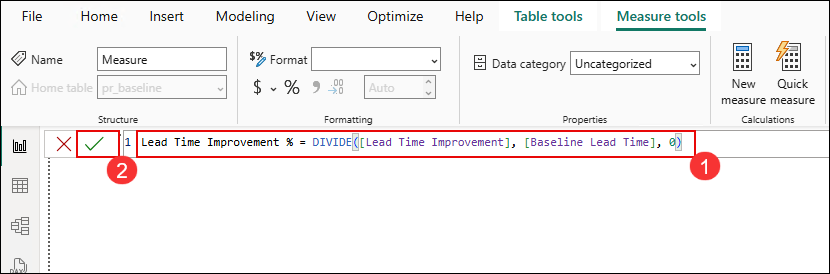

   - Format this as **Percentage (1)** with **1 (2)** as **decimal place**.

      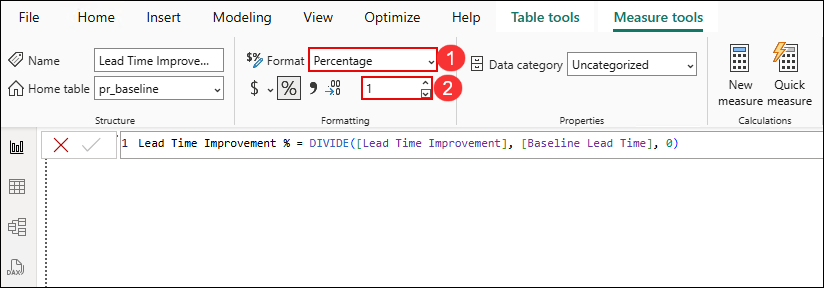

1. In the **Data** pane, right-click the **pr_baseline** table (1) and select **New measure** (2) to create a new DAX measure.

   

1. In the formula bar, paste the DAX for **Baseline Cycle Time** (1) given below and click **✔** (2) to save and apply the measure.

   ```
   Baseline Cycle Time = AVERAGE('pr_baseline'[cycle_time_hours])
   ```

   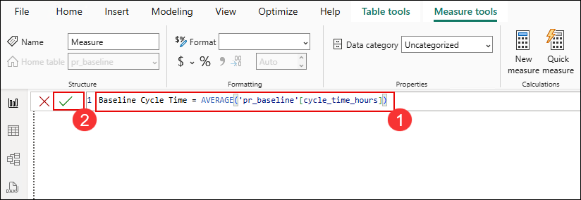

1. In the **Data** pane, right-click the **pr_post** table (1) and choose **New measure** (2) to create a post-adoption measure.

   

1. In the formula bar, paste the DAX for **Post-Copilot Cycle Time** (1) given below and click **✔** (2) to save and apply the measure.

   ```
   Post-Copilot Cycle Time = AVERAGE('pr_post'[cycle_time_hours])
   ```

   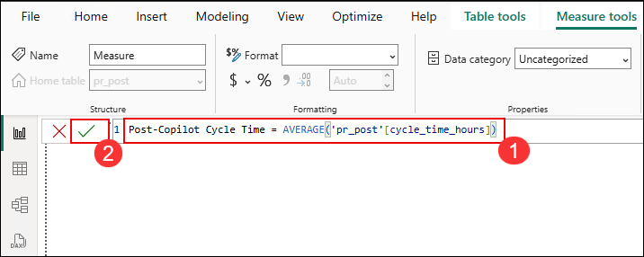

1. In the **Data** pane, right-click the **pr_baseline** table (1) and select **New measure** (2) to create a new DAX measure.

   

1. In the formula bar, paste the DAX for **Cycle Time Improvement %** (1).

   - In **Format**, select **Percentage** (2).
   - Set **Decimal places** to **1** (3).
   - Click **✔** to save and apply (4).

      ```
      Cycle Time Improvement % = DIVIDE(
         [Baseline Cycle Time] - [Post-Copilot Cycle Time], 
         [Baseline Cycle Time], 
         0
      )
      ```

      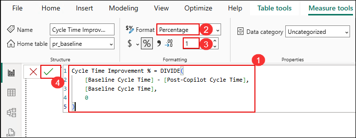

1. In the **Data** pane, right-click the **pr_baseline** table (1) and select **New measure** (2) to create a new DAX measure.

   

1. In the formula bar, paste the DAX for **Baseline PRs Merged** (1) given below and click **✔** (2) to save and apply the measure.

   ```
   Baseline PRs Merged = AVERAGE('pr_baseline'[prs_merged])
   ```

   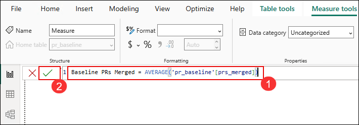

1. In the **Data** pane, right-click the **pr_post** table (1) and choose **New measure** (2) to create a post-adoption measure.

   

1. In the formula bar, paste the DAX for **Post-Copilot PRs Merged** (1) given below and click **✔** (2) to save and apply the measure.

   ```
   Post-Copilot PRs Merged = AVERAGE('pr_post'[prs_merged])
   ```

   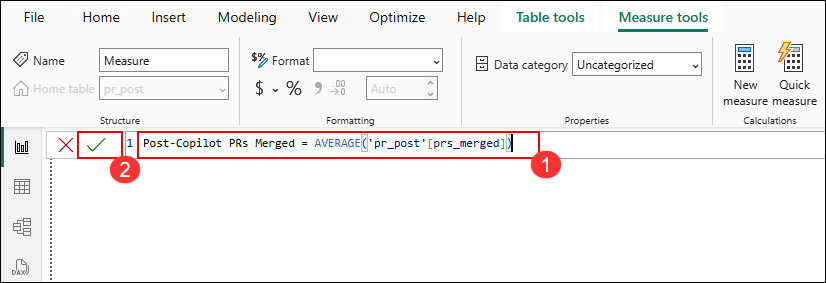

1. In the **Data** pane, right-click the **pr_baseline** table (1) and select **New measure** (2) to create a new DAX measure.

   

1. In the formula bar, paste the DAX for **Throughput Improvement %** (1).

   - In **Format**, select **Percentage** (2).
   - Set **Decimal places** to **1** (3).
   - Click **✔** to save and apply (4).

      ```
      Throughput Improvement % = DIVIDE(
         [Post-Copilot PRs Merged] - [Baseline PRs Merged],
         [Baseline PRs Merged],
         0
      )
      ```

      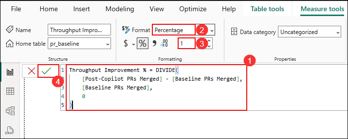

## Task 3: Build Executive-Ready Productivity Impact Dashboard

In this task, you will create compelling visualizations that clearly communicate the tangible productivity improvements achieved through Copilot adoption. These visuals will serve as powerful storytelling tools for executive presentations and business case justifications.

### A. Create High-Impact Productivity KPI Cards

1. In the **Visualizations** pane, click the **Card** icon (1) to insert a new card visual (2) onto your report canvas (3).

   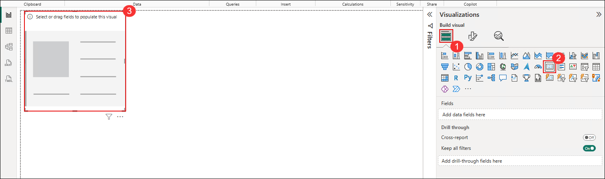

   >**Executive Communication:** Card visuals provide immediate visual impact by prominently displaying key metrics. They're perfect for executive dashboards where stakeholders need to quickly grasp performance improvements.

1. From the **pr_baseline** table (1), select the field **Lead Time Improvement %** (2) to populate the card visual (3).

      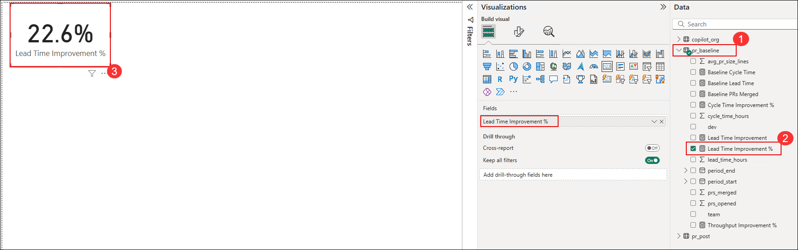

1. Repeat the same steps to create additional **Card** visuals for **Cycle Time Improvement %** and **Throughput Improvement %** to display their respective KPI values.

   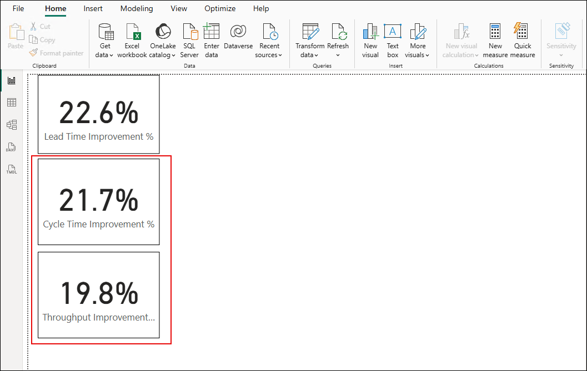

   > **Manager Value**: These cards immediately show the quantifiable impact of Copilot investment with clear percentage improvements.

### B. Create Team Performance Comparison

1. In the **Visualizations** pane, click the **Clustered bar chart** icon (2) to insert a new bar chart visual (3) onto your report canvas.

   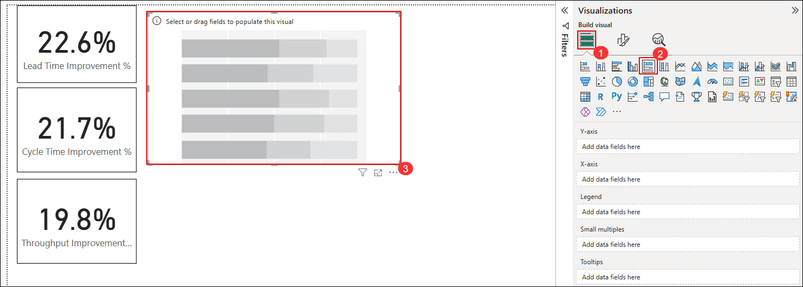

1. In the **pr_baseline** table (1), drag **team** (2) to the **Y-axis**.  

   - Drag **Lead Time Improvement %** (3) to the **X-axis**.  
   - The clustered bar chart (4) will now display **Lead Time Improvement % by team**.

      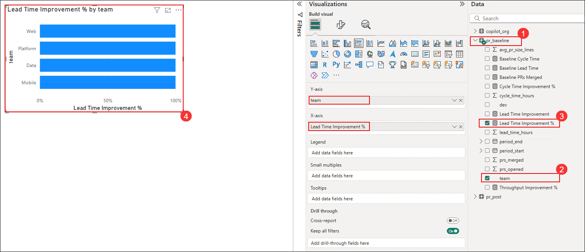

      > **Manager Insight**: This shows which teams are benefiting most from Copilot, helping identify best practices to share across the organization.

### C. Create Before/After Metrics Table

1. In the **Visualizations** pane, click the **Matrix** icon (2) to insert a new matrix visual (3) onto your report canvas.

   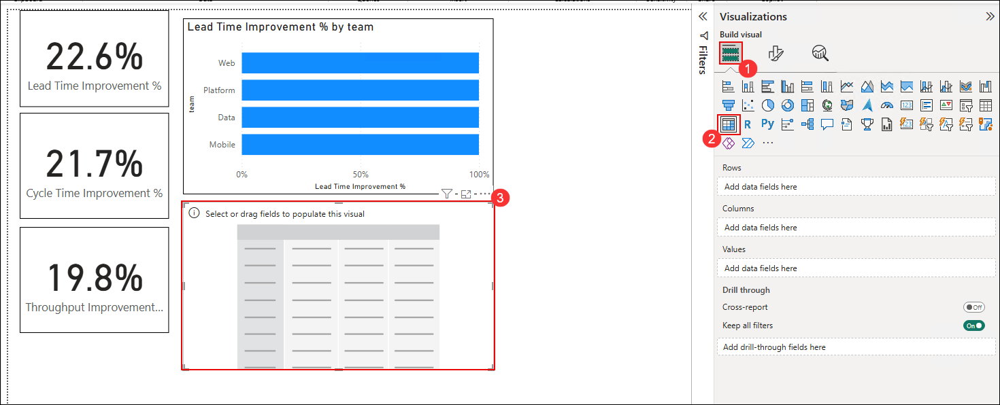

1. Configure the matrix:
   - **Rows**: team
   - **Values**: 
     - **Baseline Lead Time**
     - **Post-Copilot Lead Time**
     - **Lead Time Improvement %**
     - **Throughput Improvement %**
   
      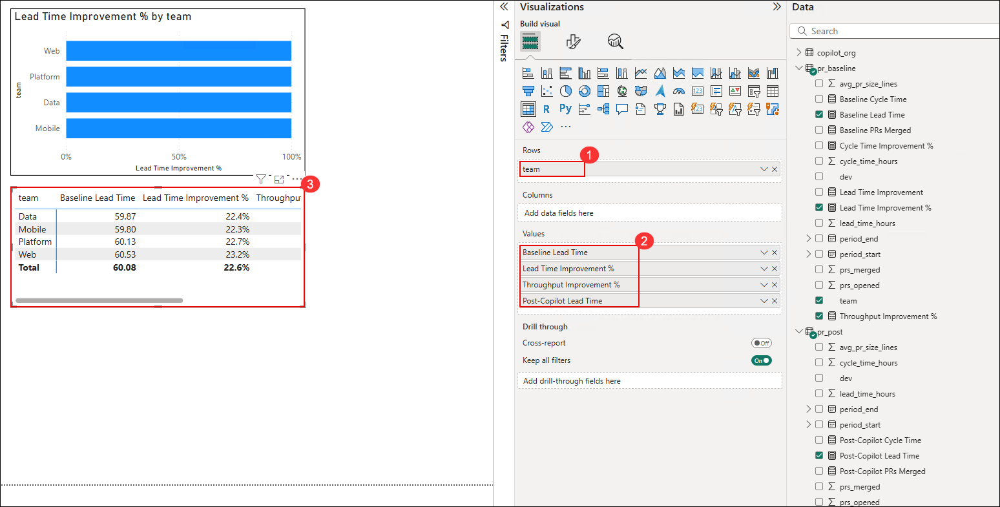

      > **Executive Value**: This provides a comprehensive view of improvements across all teams in a single table format.

### D. Add Team Performance Slicers

1. In the **Visualizations** pane, click the **Slicer** icon (1).  

   - From the **pr_baseline** table, select the **team** field (2).  
   - The slicer visual (3) will appear on the canvas, allowing filtering by team.

      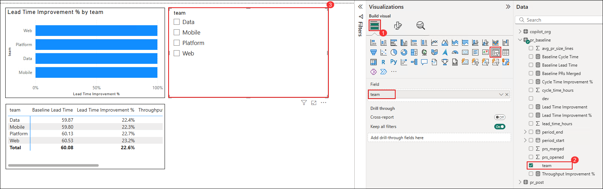

1. Select the **slicer visual (1)**, then click the **Format visual** icon **(2)**.  

   - Under the **Visual (3)** tab, expand **Slicer settings (4)**.  
   - In **Options**, set the **Style** to **Tile (5)**.

      

1. Select a team tile in the slicer (1) to instantly filter and update all connected visuals (2) on the dashboard.

   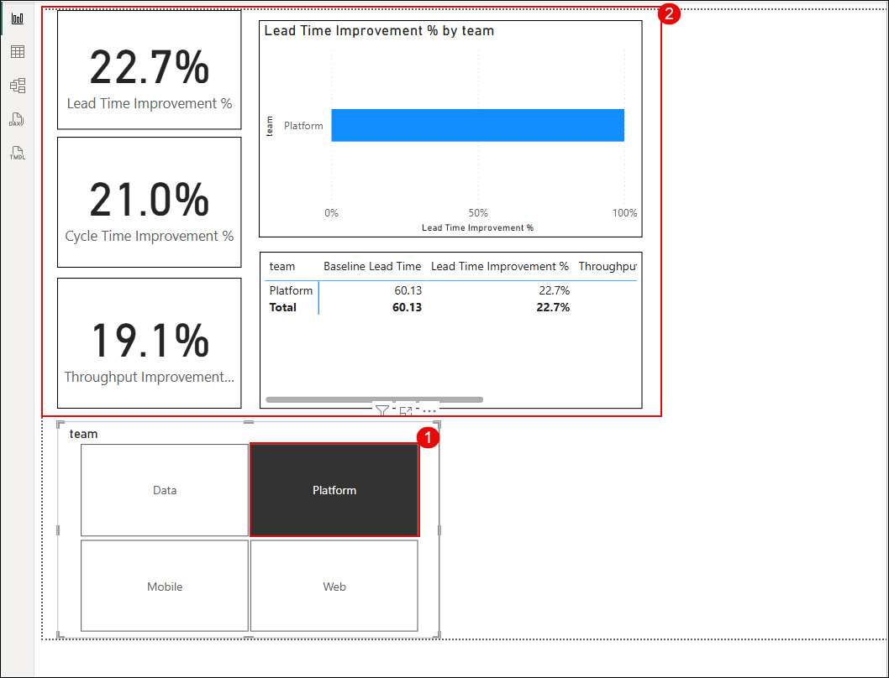

## Notes

- **Positive improvements** in lead time and cycle time reductions indicate faster delivery
- **Increased throughput** shows teams are completing more work in the same time
- Use the team slicer to analyze which teams are seeing the most benefit from Copilot
- Focus on teams with significant improvements to identify success patterns that can be replicated
- Consider that different teams may show benefits in different areas (some in speed, others in throughput)

## Summary

In this exercise, you successfully measured the concrete productivity impact of GitHub Copilot by establishing comprehensive before-and-after comparisons using pull request metrics. You created sophisticated measures that quantify lead time reductions, cycle time improvements, and throughput increases, transforming technical improvements into business-relevant insights. The executive-ready visualizations you built provide compelling evidence of Copilot's value proposition, giving you the quantitative foundation needed for ROI calculations and strategic decision-making. This productivity analysis, combined with your adoption metrics from Exercise 2, creates a comprehensive view of Copilot's organizational impact that will be essential for the final ROI dashboard in Exercise 4.

### You have successfully completed this exercise, please continue to next one >>

   
