# Measuring GitHub Copilot Impact for Managers

### Overall Estimated Duration: 1 Hour

## Overview

In this comprehensive lab series, you will master the essential skills needed to measure, analyze, and communicate the business value of **GitHub Copilot** across your development organization. Starting with enabling GitHub Copilot usage reports, you'll learn to access comprehensive organization-level data that reveals adoption patterns and user engagement. You'll then transform raw usage data into strategic management insights using Power BI, creating sophisticated measures that identify high-performing teams and technology preferences. Next, you'll measure concrete productivity improvements by analyzing pull request metrics before and after Copilot adoption, quantifying lead time reductions and throughput increases. Finally, you'll build executive-ready dashboards that calculate ROI and demonstrate clear business value through compelling visualizations. Step-by-step instructions with screenshots guide you throughout this data-driven journey.

## Objective

Master comprehensive GitHub Copilot analytics and business value measurement. By the end of this lab, you will be able to:

- **Enable & Access Usage Reports:** Navigate GitHub Copilot administrative settings to activate reporting features and download organization-level usage data for analysis.
- **Analyze Adoption & Engagement:** Transform raw Copilot data into strategic insights using Power BI, creating measures that identify team performance and engagement patterns.
- **Measure Productivity Impact:** Import and analyze pull request metrics to quantify concrete productivity improvements and demonstrate tangible business value.
- **Calculate ROI & Build Executive Dashboards:** Create comprehensive dashboards that combine adoption metrics with productivity gains to calculate return on investment and support strategic decision-making.

## Pre-requisites

- **GitHub Organization Owner** permissions to access Copilot usage reports
- **GitHub Copilot Business or Enterprise** licensing activated for your organization
- Access to **Power BI Desktop** and **Power BI Service**
- Basic familiarity with software development metrics and business analytics concepts

## Architecture

You'll progress through a comprehensive four-exercise journey:
1. **Enable Usage Reports (Read Only):** Navigate GitHub administrative settings to generate and download Copilot Activity reports with comprehensive usage data.
2. **Adoption Analysis:** Import usage data into Power BI, create strategic measures, and build interactive dashboards showing team performance and engagement patterns.
3. **Productivity Impact:** Load before-and-after pull request metrics to measure concrete improvements in lead time, cycle time, and throughput.
4. **Executive ROI Dashboard:** Combine adoption and productivity data to calculate return on investment and create compelling executive presentations published to Power BI Service.

## Architecture Diagram

## Explanation of Components

- **GitHub Copilot Usage Reports:** Activity reports providing comprehensive per-user metrics including code suggestions, acceptances, chat interactions, and technology preferences for adoption analysis.
- **Power BI Desktop & Service:** Business analytics platform for data transformation, visualization, and interactive dashboard creation with publishing capabilities for executive sharing.
- **Pull Request Metrics:** Development productivity indicators including lead time, cycle time, and throughput that enable before-and-after comparisons to quantify Copilot's impact.
- **ROI Analysis Framework:** Systematic approach to calculating return on investment by translating productivity improvements into financial value and business justification.

## Getting Started with the Lab

Once you're ready to dive in, your virtual machine and lab guide will be right at your fingertips within your web browser.

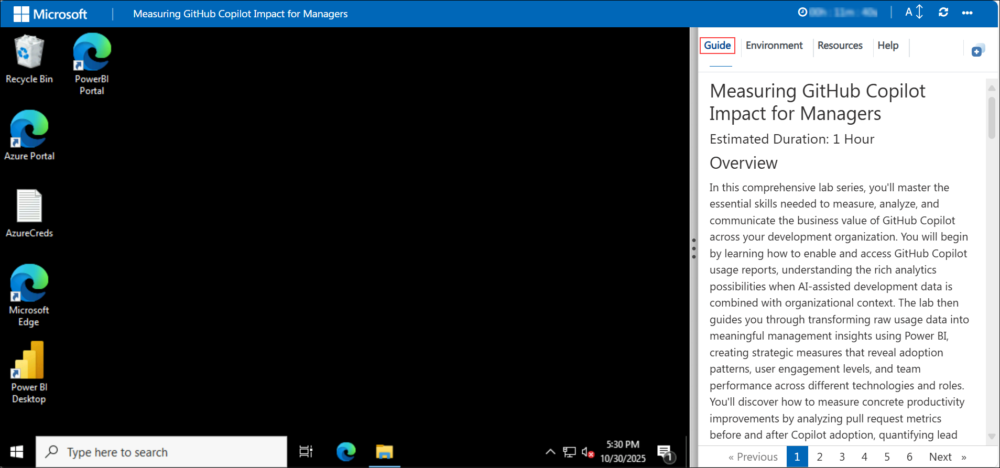

## Virtual Machine & Lab Guide

Your virtual machine is your workhorse throughout the workshop. The lab guide is your roadmap to success.

## Exploring Your Lab Resources

To get a better understanding of your lab resources and credentials, navigate to the **Environment** tab.

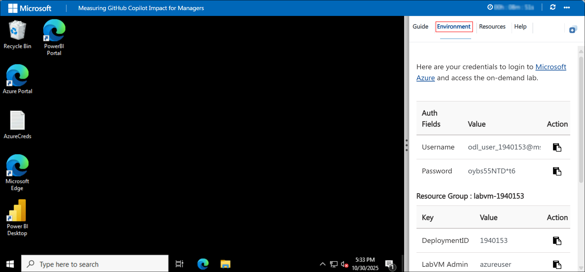

## Utilizing the Split Window Feature

For convenience, you can open the lab guide in a separate window by selecting the **Split Window** button from the top right corner.

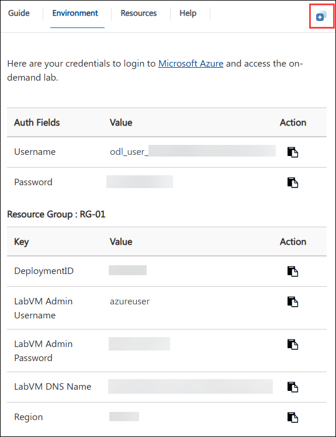

## Managing Your Virtual Machine

On the **Resources (1)** tab, use the **Action buttons (2)** next to your VM. Feel free to **start**, **stop**, or **restart** your Virtual Machine as needed. Your experience is in your hands!

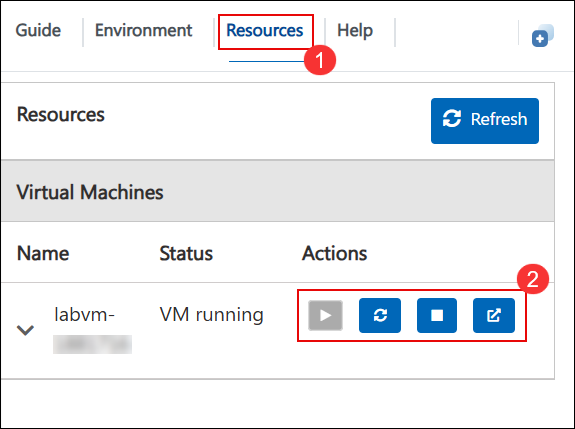

## Lab Guide Zoom In/Zoom Out

To adjust the zoom level for the environment page, click the **A↕ : 100%** icon located next to the timer in the lab environment.

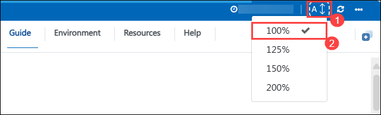

## Let's Get Started with Power BI Portal

1. On the Lab VM, Open **Power BI Desktop** from the desktop of your lab environment.

    

1. In the app window, click **Sign in** (top-right) to start the login process.

    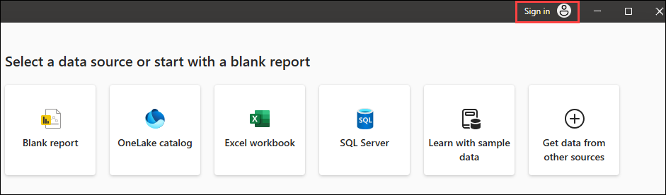

1. On **Enter your email address (1)** and click **Continue (2)**

    - **Email/Username:** <inject key="AzureAdUserEmail"></inject>

      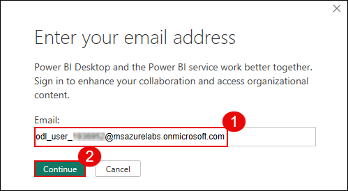

1. When prompted again, sign in with the email and click **Next (2)**.

     - **Email/Username:** <inject key="AzureAdUserEmail"></inject> **(1)**

      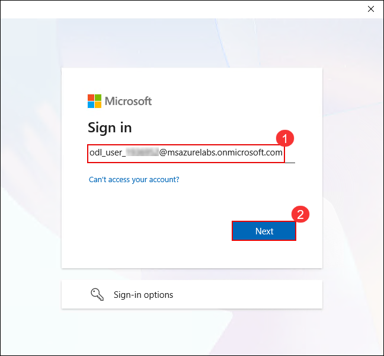

1. Enter the **password (1)** and click **Sign in (2)**.

    - **Password:** <inject key="AzureAdUserPassword"></inject>

      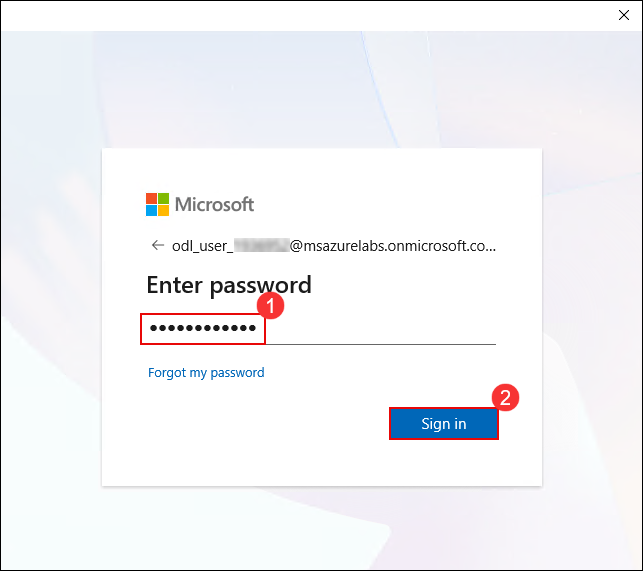

1. For the prompt **Automatically sign in to all desktop apps and websites on this device?**, select **No, this app only**.

   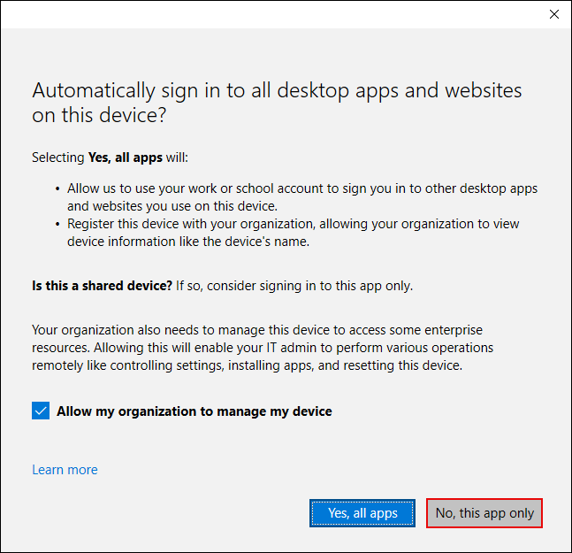

1. If the **Power BI free license assigned** message appears, click **OK** to continue.

   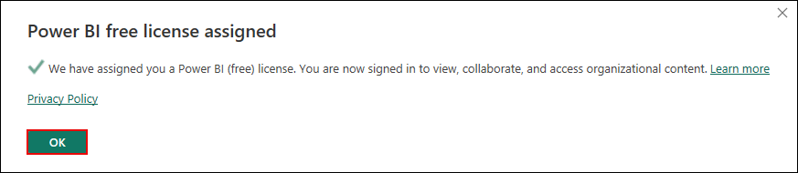

## Support Contact

The CloudLabs support team is available 24/7, 365 days a year, via email and live chat.

**Learner Support Contacts:**
- Email: cloudlabs-support@spektrasystems.com  
- Live Chat: https://cloudlabs.ai/labs-support

Click **Next** at the bottom-right to begin your lab journey!

## Happy Learning!!
